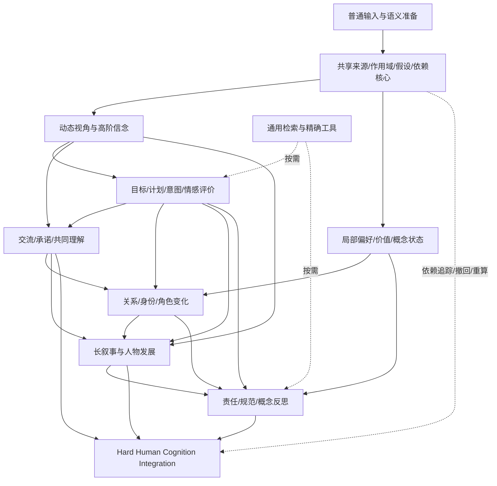

# HCL Long-Horizon Capability Master Plan

[C02 planned structured input](docs/HCL_C02_PLANNED_INPUT.md) now reuses the same
source-anchored conditional bridge for the unchanged action-explanation tool.
Action-time conditions, competing goals, source revisions and original-only
citations remain explicit. This closes a demonstrated input-integration gap;
remaining breadth work pauses for end-to-end readiness and a separately
authorized live delivery check. No provider call or native parser change.

## Current implementation policy — owner correction 2026-10-03

[LLM-directed understanding and required HCL execution](docs/HCL_LLM_ROUTING_EXECUTION.md)
lets the model interpret the request, select useful existing HCL operations and
construct their arguments. One selected B01/C01/C02/C03 operation can reuse anchored
interpretations from that same first planning response through the existing
conditional tools, with no additional provider phase or native parser change.
A final model answer requires an actual native HCL result, including an honest
insufficient-evidence result; empty or entirely
unavailable plans cannot silently continue to an answer. Selection accuracy and
checked treatment remain separate from invocation. Source authority, privacy and
budget guards stay in force. New adapter expansion is deferred while the complete
usable flow is verified. This does not require HCL to independently solve language
understanding, and it authorizes no model spending.

**版本：Canonical 1.0 · 2026-09-29**  
**仓库：`haohongfei2001-png/human-cognition-layer`**  
**最终核对基线：`main@310b667280769dc1b19c2a8e463e8f6171652cec`（PR #160）**  
**主要运行时审阅基线：`b31d8c29f64e5a2b1d62462de0ff58729b743ac9`（PR #159）；随后完整核对 PR #160 差异，该 PR 未改动 `hcl/` 运行时代码。**  
**性质：HCL 长期 capability architecture 与 development roadmap 的 canonical 事实源。与其冲突的旧开发节奏由本文件 supersede；历史 evidence disposition 与 closure 事实不被改写。**

> 目标：把可外挂于强基础模型的 Human Cognition Layer，建设成能从普通输入进行证据有界、视角敏感、可修订、跨能力组合推理的认知工作空间。先建设真实能力，再集中验证实际增益，最后审计权威榜单。架构是可证伪的设计方案，不是已经证实有效的认知理论，也不承诺某种可证明的能力上限。

## 执行授权补充（最新 owner 指令）

本计划本身不产生外部授权。采用之后 owner 已另行授予 DEFAULT AUTONOMY /
DEFAULT APPROVAL：必要、合理、可审计、可逆的路线工作自主执行；现有
provider/API/credential/billing 内正常且有必要的低成本开发调用无需逐次请示。
限定次数、记录 usage/cost，不重复已回答的问题；A–C 仅必要 live-entry，
Serious Independent Evaluation 主要在 G-ARCH 后。历史已消费 grant 和剩余预算
不重新使用。新外部 onboarding/凭据、异常大额成本、隐私或许可等硬边界路径
应 defer 并继续独立工作。本补充覆盖下文旧的逐次 owner spending gate，
不改变能力、依赖、证据标准、G-HC/G-ARCH 或 LongMemEval 封存边界。

## 最新验证节奏修订 — Owner 2026-10-01

正式区分 **Development Reality Checks** 与 **Final Sealed Confirmation**。
详见 [canonical two-track policy](docs/HCL_VALIDATION_TIERS_POLICY.md)。即日起恢复
开发现实检验：新且合法的公开任务、冻结 subset / 模型配置 / 评分，strong Base
与 current HCL 同底座公平普通输入优先；独立 reviewer、完美 confirmation 来源、
P/G 工程和最终统计标准不再阻塞日常开发。查看过的题目/答案/结果立即标记
DEVELOPMENT_EXPOSED / CONSUMED_FOR_FINAL_CONFIRMATION，可调试回归但不得进入最终
独立确认。发现错误后做通用修复/覆盖改善/简化，不做单题规则，不改历史结论。

§11 的严格独立来源、blind review、强比较器、ablation、cross-model 与统计标准
属于能力基本冻结后的 Final Sealed Confirmation，保留其证明边界，不用来否定
开发检验资格。G-ARCH 后先用真实 Development Reality Checks 驱动修复与能力成长，
不以缺少最终 reviewer/source 宣布全局停滞。首批 DRC001 已冻结 SimpleToM/SocialIQA
开发任务与 Base/HCL 两臂；旧 I02 dependency handoff 的全局停滞条件已 supersede。
LongMemEval 继续 SEALED，leaderboard maturity gate 与旧 frozen receipts 不变。

## 0. 决策摘要

建议批准的方向不是“再增加一个 CG 检查器”，也不是“立刻验证所有已存在模块”，而是：

**普通语言入口 → 证据与解释分离 → 动态认知状态 → 互动与关系更新 → 长叙事整合 → 规范与概念整合 → Hard Human Cognition Integration → Independent Generalization → 权威目标审计 → 系统优化 → 榜单提交。**

中期撤销“每项能力后必须五臂比较”“最多两个已实现但未验证候选”的开发限制。保留来源、人物、时间、视角、否定、不确定性和历史回归的工程边界。允许大量已经正确集成、尚未证明外部收益的能力继续建设；不得把这些能力改称 validated。

整体采用八个建设 wave，A00–A05 六包，B–H 每波五包，共 **41 个工作包**。A00 是采用与治理包，其余 40 包为实现、迁移或实质集成包。工作包不是小时估计、PR 数量承诺或必须逐个拆 PR 的要求。

## 1. 当前基线与证据分级

### 1.1 当前事实

最终读取到的 main 为 `310b667280769dc1b19c2a8e463e8f6171652cec`，合并 PR #160，时间为 2026-09-28 18:38:56 UTC，即 Asia/Taipei 2026-09-29 02:38:56。该 PR 完成 POST-CG05 gap review，并更新下一任务。此前的运行时审阅基线为 PR #159 的 `b31d8c29f64e5a2b1d62462de0ff58729b743ac9`，合并时间 2026-09-28 18:29:41 UTC；对 b31d8c29 的 GitHub 检查读取到六项 completed/success，其中 v1 integration run 为 `36465576188`。这些检查属于 b31d8c29，不能冒充 310b6672 的 exact-main 认证。本次仅读取已有检查，没有重跑 HCL 测试或模型实验。

当前 `STATUS.md` 与执行注册表的 disposition：CG01 普通文本路线 SIMPLIFY/CLOSED，CG02 INCONCLUSIVE/CLOSED，CG03–CG05 RETAIN_DEVELOPMENT_ONLY；零个待关闭候选，付费授权已关闭。POST-CG05 CAPABILITY GAP REVIEW 已完成，当前唯一下一项为 **EG01-A_SOURCE_FIRST_NATIVE_SEMANTIC_PREPARATION_AND_TREATMENT_QUALIFICATION_OF_RETAINED_CAPABILITIES**，即已保留能力的普通语义接入与独立泛化准备，不自动创建 CG06。旧 NI closure 中的 CG04/CG05 deferred 描述是当时状态，不是当前状态。[R1–R4、R14]

| 资产 | 能保留的事实 | 不能推出的结论 |
|---|---|---|
| v0.4/v0.5 | 来源、人物、时间、显式立场、可回放记录 | 通用人物理解或更好的长记忆已经证明 |
| v0.6 | 有限视角、信念证据与修订；已有有限历史外部信号 | 任意阶心智理论、广泛模型迁移、现代强推理模型增益 |
| v0.7/v0.8 | 意图、目标、情感、评价的可选结构化证据 | 真实动机或情绪动力学已建立 |
| v0.9/v0.10 | 在声明模型或论证图内的精确条件计算 | 世界因果、道德真理、心理理解能力 |
| CG01 | 条件约束检查器仍可供合格输入使用 | 原普通文本实验测试了检查器效力；当时四例提取都失败，H/H-new 输入相同 |
| CG02 | 社会行为与期待的条件检查可继续复用 | 24/28 对 7/28 或 9/28 是可信能力效应；原比较存在标签暴露不公平 |
| CG03 | 五种责任因素和显式规范前提的可选检查 | 广泛责任判断或道德推理已经成熟 |
| CG04 | 情境偏好适用性、未知条件、局部修订检查 | 一般价值理解已经成熟 |
| CG05 | 局部词义标准、未知属性、反例与局部修订 | 抽象概念或哲学能力已经成熟 |
| NI01–14 | 普通问句、来源修订、两人视角、有限多事件和检查状态组合 | 长篇叙事与集成认知增益已经证明；本地 adapter stub 不是模型理解 |

CG03、CG04、CG05 各自的 28 个评分字段来自 **四个自编开发案例**，不是 28 个独立样本。这些结果有局部设计价值，但不能提供总体能力效应估计。[R8–R10]

### 1.2 最重要的架构缺口

现有 person-question 路线的多事件入口要求 2–4 个显式事件段，总计 24 行/16,000 字符以内；许多关系依赖固定句式和字面名称。组合层主要分别执行现有操作，再一起提交模型，另有少量源范围 join。它是有用起点，不是最终集成推理体系。[R5–R6]

当前主要瓶颈据此判断为：**语义进入能力、真正的高阶信念、可撤回推断、跨能力更新、长叙事证据选择与一体化解释。** 继续增加相似布尔条件检查器，不足以填补这些缺口。

### 1.3 对最新 PR160 决策的判断与调整

PR160 记录：对八个此前已作来源审阅、未由 provider 执行的 DREAM 对话家族，用原始问题与文本、无人工心理状态、无模型调用检查入口，得到 **0/8 专门 treatment**；失败均为不支持或含糊的问题范围。它没有给基础模型评分，不能据此断言强基模有心理能力缺陷，也不能断言全部 DREAM 都不适用。该范围诊断值得保留，不重跑、不改写为正面证据。[R14]

我赞同修复通用普通输入入口，但不赞同在本次“最大化长期能力建设”目标下，继续把独立泛化资格审查放在整个建设主线之前。**“现有实验没有隔离出强基模缺失的心理能力”与“HCL 架构没有尚未建设的关键操作”不是同一个命题。** 真正高阶信念、可撤回行动解释、互动更新和长叙事跨能力依赖，都可从接口与行为要求上定义明确缺口；其对强基模的增益则必须留待后续整体实验检验。

因此将 EG01-A 拆成两部分：通用任务/来源/人物/时间/访问的语义准备纳入 Wave A02–A05；独立题源 qualification、比较包冻结与 provider-backed efficacy 则纳入后面的 Independent Generalization。不是丢弃当前工作，也不是为了编号强行开启 CG06，而是按新目标重排已有工程与后续研究。

## 2. Canonical policy：替换哪些旧规则

本节自本文件合入 main 起生效。它改变研发节奏与执行优先级，不改变任何历史实验结果、预算、许可或 provider 授权。

| 旧约束 | 新规则 |
|---|---|
| 每项 capability 实现后立即冻结/运行 C/P/G/H/H-new | 每包做五类工程检查；集中在架构成熟后进行整体验证 |
| 最多两个 implemented-unvalidated candidates | 不限已集成但未经效力验证的能力；同时未集成的实验性分支原则上不超过两个 |
| 能力包通常经过外部比较与处置，再进入下一能力 | 未有 efficacy 不阻止依赖安全的实现；明显机制错误仍必须修复、简化或删除 |
| PR160 当前选择独立泛化准备优先 | 保留 EG01-A 的通用语义接入实现，纳入 A02–A05；独立题源 qualification、比较包与 serious evaluation 后移至整体成熟阶段 |
| 新运行时必须持续保留所有旧实验 final-message 字节 | 旧实验及其 runtime/package 永久冻结；新运行时保留语义边界，不必保留旧提示词和序列化字节 |
| 当前默认零提取、一次最终回答；普通入口主要依赖有限语法，另有显式 opt-in 语义适配器 | 保留直接廉价路径；复杂路径允许显式预算内的语义准备、检索和有限重审；费用必须单独授权 |
| 不得建设新结构，本体一概禁止 | 允许必要的薄关系模式与计算状态；禁止庞大固定心理分类、统一人格/信任/道德本体 |
| 不支持的输入一律结束整项分析 | 安全隔离失败范围；保留可用证据与可回答部分，不泄漏隐藏来源、不伪装完整性 |

历史错误、负面结果、INCONCLUSIVE、消耗过的案例及封存数据不因重构而修改。LongMemEval 保持封存。研究报告不可被当作当前运行规则；旧运行时也不应永久决定新架构的上限。

## 3. 最终 capability architecture

### 3.1 设计目标：认知工作空间，而不是心理标签集合

建议的总架构：

```text
普通问题 + 获准来源
        ↓
语义准备：候选人物/事件/命题/关系/解释 + 原文定位
        ↓
共享证据与作用域核心
  ├─ 人物、来源、事件时间、获知时间、记录时间、叙述次序
  ├─ 断言 / 归因 / 解释假设 / 条件假设 / 工具结果分离
  └─ 支持、反证、修订、依赖、访问权限和版本
        ↓
按问题构造有限认知工作空间
        ↓
选择并组合所需认知操作
  ├─ 视角与信念更新
  ├─ 目标、计划、意图与情感评价
  ├─ 交流、期待、误解与策略
  ├─ 关系、身份、角色和价值变化
  ├─ 长叙事、多人物和人物发展
  └─ 责任、规范、概念与哲学分析
        ↕
通用检索 / 约束求解 / 因果条件计算 / 论证与反例工具
        ↓
竞争解释比较 → 缺失证据定位 → 必要时局部重算
        ↓
有证据、有条件、有不确定性边界的最终回答
```

共享依赖图和调度器本身属于通用工程，不自动构成 specialized HCL。真正需要检验的特殊性是：人物视角、信念、交流理解、行动解释、关系归因、规范与概念等操作，以及这些操作能否在同一证据链上产生额外语义收益。

### 3.2 最小共享表示

不要为每个能力重新建立 Actor、Source、Time、Uncertainty 和 Revision。共享核心至少表达：

| 结构 | 必要字段/语义 |
|---|---|
| SourceSpan | 来源身份、原文位置、片段、来源版本、获准处理范围；定位正确不等于语义解释正确 |
| Entity / Event | 人物及别名候选、事件参与者、说话者、被谈论者、事件身份；歧义不得靠同名或相似词硬合并 |
| Scope | 人物、观察者、情境、角色、事件范围、时间范围、来源可见性、假设分支 |
| Claim | 命题、极性、陈述者、对象、来源类型、支持与反证；报告的内容不自动为真 |
| Interpretation | 候选解释、所需前提、支持、挑战、替代解释、未知条件、适用范围 |
| CognitiveState | 信念、目标、计划、承诺等各自的领域状态；不强迫所有状态共用一套心理枚举 |
| Dependency | 哪些证据及假设支持某结论；失效后哪些派生状态必须重算；支持关系允许多个替代依据 |
| OperationResult | 实际执行的操作、输入/输出、范围、依赖、失败原因、预算、条件性、来源定位 |

至少区分四种“时间”：事件发生时间、人物获知/接触时间、系统记录时间、叙述/来源次序。没有日期时保留偏序或未知，而不合成真实日期。

至少分离这些语义状态：来源报告、人物公开表态、系统对私人信念的估计、人物明确表达的不确定、系统证据不足、互相冲突的证据、依赖前提的假设、精确工具的条件结果。

### 3.3 两种推理制度必须并存

**证据与明确陈述通道**记录“谁在何时说过什么”“谁有证据接触过什么”。它不依赖读心。

**可撤回解释通道**允许从行为、语境、已知目标、机会与历史提出解释；每个解释都必须保留前提、反证与替代解释。解释被削弱不等于人物真的改变了心态；新证据使系统修订过去的判断，也不等于新事件改变了过去。

禁止从“没有直接自述”推出“不能推理”，也禁止从“很像某个动机”推出“真实动机已经确定”。当多种解释都能成立时，应给出有依据的比较，并说明哪项证据能够区分它们；不要机械平列所有可能性。

**关键独立性：**否定事实提升，不是否定推断本身。允许有条件的跨能力推断，禁止无依据的语义升级。

### 3.4 证据边界不能仅靠最后一段提示词

授权范围先于任何提取。人物视角内的候选生成、检索和状态更新也必须受可见来源约束；不能先给模型全部隐藏资料，再删掉最后输出中的来源 ID。

新增不可见材料不应改变该人物视角的结构化状态和实际输入。这种非干扰性可以在模型调用前检查；最终模型是否遵守输出边界仍需要后续运行观察，不能用 schema 检查声称已保证。

同一报道的转述或复制不构成多个独立证据。公开可获得、实际接触、理解、相信、知道事实为真、双方知道对方知道，必须分别表示。

### 3.5 语义准备不是另一个 oracle

新语义适配器应接收普通文本，提出实体、事件、命题、指代和关系候选，而不要求用户输入正确心理状态。原文位置尽量由程序确认和归一化，不让模型生成的近似引文冒充精确来源。

结构验证、引用验证和语义支持验证分开记录。通过前两者不能自动通过第三者。歧义指代、含蓄动机、隐喻和反讽可保留多个解释分支；只在与问题有关时展开。高风险更新可以触发一次有预算的反例/反向解释检查，不应为每一句话增加一轮模型审判。

语义调用必须可插拔、可记录、可计费。建设期可用 replay/stub 检查接口与负面边界，但这类结果只能记为 REPLAY_VERIFIED，不能冒充实际语言入口已经可用。

## 4. 能力层级

层级表示组合复杂度，不是要求高层任务先运行全部低层模块。每层复用共享核心；下面的“方向不成立”指应拒绝该实现或机制主张，不是否定整个认知领域。

### Level 0 — 证据、解释与作用域

**新增能力：**区分人物、来源、视角、陈述、推断和不同时间，保留冲突与历史，支持可回放的局部更新。

**依赖：**无；复用 v0.4–v0.6 的已有效边界。

**最小机制：**共享来源定位、作用域投影、证据依赖、版本与撤回。主要是通用基础设施，人物可见性语义需 HCL 明确处理。

**避免：**巨大世界知识图谱、所有陈述都当事实、来源身份等于可靠度、固定数值置信度。

**简化旧结构：**合并重复 scope/source/condition/uncertainty 校验；保持历史运行时可回放，不复制整套 v0.x 状态机。

**不成立信号：**来源身份或作用域无法贯穿操作；隐藏来源可影响人物输入；撤回一个依据会无差别删除全部历史。

### Level 1 — 动态视角与心智状态

**新增能力：**一阶信念、有限高阶信念、误信、未觉察、争议信息与信念修订；区分 A 知道 B 接触了 p 和 A 认为 B 相信 p。

**依赖：**L0 的来源、时间、可见性与版本。

**最小机制：**按需求生成 `Believes(A, p)` 与 `Believes(A, Believes(B, p))` 等有限结构；分别维护信息接触、表态和私人信念解释；暴露、挑战、反驳与接受有不同转移。

**避免：**逻辑全知、默认正/负内省、把公开消息当共同知识、枚举所有人物的任意阶世界。

**简化旧结构：**复用 v0.6 边界但不把它的 access intersection 当完整高阶信念；新路径不沿用 v0.5 的接触新信息就暂停旧立场来模拟真实信念。v0.6 已经将挑战与信念修订分开，不能把已修正问题误报为当前 bug。

**不成立信号：**二阶状态只是重命名一阶记录；收到消息就自动相信；修订系统估计被错误写成人物自身改变信念。

### Level 2 — 能动性、行动解释与情感评价

**新增能力：**目标层级、手段与目的、计划可行性、计划修订、多重动机、机会与控制、混合情感及再评价。

**依赖：**L1 的人物信息与信念；L0 的证据依赖。

**最小机制：**目标—子目标—计划—前提—行动关系；分别计算人物相信可行和模型条件下可行；用竞争解释检查行动时所需知识、目标、机会和代价；情感作为事件—目标—评价之间的有据解释。

**避免：**每个人都效用最优、一次行为证明长期目标、行为/表情直接映射唯一情绪、人格或临床诊断。

**简化旧结构：**v0.7/v0.8 作为薄证据适配器；CG01 提炼成解释条件操作，而不是维护单独的小故事语法宇宙。

**不成立信号：**把“行动与目标相容”当作动机证实；只有硬编码行为标签才能推断；更新目标后计划和相关解释仍不变。

### Level 3 — 互动、共同理解与策略

**新增能力：**多方交流、承诺、期待、共同理解形成/失败、误解修复、策略性表达、隐瞒及欺骗解释。

**依赖：**L1 的高阶心智状态；L2 的目标、机会与解释条件。

**最小机制：**陈述内容、说话者意图候选、接收者接触与理解、公开承诺和实际履行状态分离；有限共同理解闭包；用发送者信念、目标与接收者解释比较候选策略。

**避免：**说错话等于说谎、条件承诺等于无条件义务、沉默等于欺骗、听到同一消息等于共同相信。

**简化旧结构：**将 CG02 的 act/condition/expectation 校验纳入同一互动状态，不再围绕一组固定枚举建立独立语义世界。

**不成立信号：**无法区别善意误报、明知虚假和字面为真但可能误导；缺少知情/意图依据时却作确定恶意判断。

### Level 4 — 关系、身份、角色与价值变化

**新增能力：**领域化信任、合作和冲突、关系修复、身份叙事、自我模型、角色冲突、情境偏好与价值张力。

**依赖：**L1–L3 的信念、目标与互动历史。

**最小机制：**按双方/领域/角色/事件/视角索引的关系证据；自我认同、他人归因和表现行为分离；比较“价值变化”“信念变化”“外部压力”“角色切换”等竞争解释。

**避免：**统一信任分、friend/enemy 标签、固定人格向量、从一次选择反推稳定价值、把角色规则当作本人赞同。

**简化旧结构：**复用 CG04 的局部偏好与条件检查；关系和身份先采用通用带来源记录，只在归因、修订与跨时一致性确实需要时增加专门操作。

**不成立信号：**情境变化被当人格改变；关系模块只是填数值；对行为失败自动扣信任；没有独立能力增量却扩展实体种类。

### Level 5 — 长时程叙事与多人物认知

**新增能力：**长篇、多人物、多来源、插叙、迟到揭示、不可靠叙述、持续信息不对称、人物发展与多解释共存。

**依赖：**L0–L4；证据检索和增量状态是贯穿性基础，不应直到这一层才设计接口。

**最小机制：**事件与认知转折索引、分视角 episodic memory、依赖驱动重算、叙述时间与故事时间分离、可回源的假设与摘要；按问题提取必要证据闭包。

**避免：**全篇强制压成一段总结、预设成长/救赎叙事模板、更多上下文等于更深理解、为每人维护完整全知世界。

**简化旧结构：**NI 的多快照/来源池作为过渡；新路径不永远受 2–4 事件和 24 行限制；新回答不再必须拼接所有完整操作状态。

**不成立信号：**长文只是能装进去而不能跨章节更新；摘要丢失反证、归属或未解决承诺；后来的揭示污染旧时点人物视角。

### Level 6 — 规范、概念与反思性整合

**新增能力：**责任与可控性、个人及集体能动性、价值冲突、规范前提比较、局部词义与概念变化、抽象论证、哲学问题中的关键分歧识别。

**依赖：**L1–L5 提供人物、情境、行动与发展；规范和概念的薄表示从早期即应可用。

**最小机制：**事实依据、归因解释、规范前提、概念读法和结论之间的条件依赖；多前提敏感性分析；反例、概念替换、论证支持/攻击、反事实条件分析。

**避免：**唯一道德分数、哲学流派穷举器、形式有效等于前提为真、所有解释同样好、把复杂概念限制成固定布尔词典。

**简化旧结构：**CG03/CG05 作为可复用子操作；v0.9/v0.10 仍为条件 exact tools，不升级为道德裁判。

**不成立信号：**去掉“道德/身份”等名称后仅剩枚举校验；只能复述不同观点，不能定位真正分歧；生成了论证图却无法说明其自然语言解释假设。

## 5. 实现类型：哪些值得专门建设

“需要专门机制”是本方案对操作语义的设计要求，不是声称实验已证明任何 particular implementation 不可替代。

| 能力 | 主实现方式 | 专门机制应承担什么，而不是重复什么 |
|---|---|---|
| 来源、版本、时间索引、支持依赖 | 通用结构化状态/工具 | 不把数据库和依赖图包装成人类认知突破 |
| 人物视角、信息接触、高阶信念 | 专门 HCL 操作 + 通用状态 | 范围化投影、嵌套对象、更新和非干扰边界 |
| 信念修订、不确定性 | 专门转移语义 + 通用依赖维护 | 区分人物心态变化与系统估计变化；未知、否定、冲突分离 |
| 意图和动机 | 模型提出候选 + HCL 条件/反证比较 | 不写行为到真实动机的规则表 |
| 目标、计划、修订 | 通用目标图/约束工具 + 心智视角操作 | 人物相信能做、实际条件能做、是否承诺去做分开 |
| 情感与评价 | 通用情节证据 + scaffold；必要时条件比较 | 允许混合、归因与再评价，不建情绪预测器 |
| 承诺、共同理解、策略交流 | 专门 HCL 操作 | 表达、接触、理解、期待、承诺及履行不混同 |
| 信任、合作、关系 | 通用领域化证据 + 有条件的归因/修订 | 不先建设统一关系分数系统 |
| 身份、自我模型、角色冲突 | 通用有来源状态 + 跨时解释比较 | 不预装人格/身份本质论 |
| 情境偏好、价值冲突 | 结构化局部偏好 + 条件适用/冲突操作 | 不把选择反演成固定效用函数 |
| 责任、能动性、控制 | HCL 因素分离 + exact conditional tools | 区分事实、行动时视角、可选行动和规范判断 |
| 局部概念、概念变化 | 模型读法候选 + HCL 范围/反例/修订操作 | 语义对齐有条件，不能靠相同词形强行合并 |
| 叙事与人物发展 | 专门跨时/跨视角组合 + 通用记忆/检索 | 维护认知转折与竞争解释，不仅存文本 |
| 抽象/哲学创造与表达 | 强基模/scaffold 主导，HCL 做依赖和反例整合 | 不重写基础模型的语言知识，不把形式解当世界真理 |
| 求解、时间排序、声明的因果/论证模型 | 通用 exact tool | 输入假设不完整时保留条件，不能自动补成真实模型 |
| 全局人格、唯一道德真理、无限递归心智世界、默认多代理辩论 | 不实现为默认系统 | 高复杂度不等于能力；没有必要性和有界语义不得立项 |

## 6. 依赖图与真正的组合



这是建设依赖图；运行时不是每次沿图全部运行。反馈通过版本化状态与操作依赖实现，禁止不受控循环。

**每个操作的最小契约：**输入与输出类型、读取作用域、前提与支持依据、不可推出的结论、被挑战时的失效范围、是否变更状态、资源上限。输出至少有可追踪的证据和假设；没有支持依据的推断不得写入事实通道。

**组合的合格例子：**一条迟到的获知证据，改变系统对 A 在行动时信念的估计；这影响某个计划/动机解释的可行性；进而改变对承诺落空和关系冲突的解释；责任结论在某规范前提下随之变化。每一步保留自己的条件，不把上一步的可能性升级为确定性。与这条证据无关的其他角色、关系和价值判断必须保持不变。

**不合格例子：**分别输出六个模块的 JSON，然后说“已实现集成认知”。

## 7. 长期 development waves：41 个可执行工作包

以下依赖是默认执行顺序。每包必须通过第 8 节的五类工程检查，提供实际状态/调用输入证据。每个 wave 以 integrated/correctness-verified 收口，不要求五臂实验、独立 benchmark 或显著效应。**41 个 work packages 不等于 41 个 PR；Work 应按 coherent stable slice 合并，禁止为跑满时间制造 filler PR。普通 bug、CI、测试、merge 与 harness 修复由 Work 自行处理。**

### Wave A — 统一核心与普通输入入口

**Capability delta：**从一段自然文本建立共享、可追溯、可撤回的认知材料；已有能力能够消费同一材料，不再分别依赖自己的小语法。

**依赖：**现有 main。**复用：**v0.4–v0.6、v1 registry/router、CG01–05 和 NI 的有效边界。**不做：**推倒全部旧目录、先搭完通用平台再证明能处理一个人物问题。

| 包 | Work 实现任务 | 本包必须展示的行为 |
|---|---|---|
| A00 | 采用本计划，更新 live plan/status 的当前政策；承认 PR160 gap review 已完成并重排 EG01-A，而不重做审查；保留旧报告；分离 implementation、入口验证、efficacy 和 activation 四种状态 | 旧“两候选上限”和“每模块五臂”不再阻止依赖安全的建设；历史证据不被升级 |
| A01 | 建立共享 SourceSpan、Scope、Claim、Interpretation、Dependency 最小核心；加入类型与版本适配器 | 同一来源的信念、概念、责任记录共享身份；人物、来源、时间和假设不丢失 |
| A02 | 吸收 EG01-A 中尚未完成的通用入口工作，建立统一 semantic-preparation 接口；支持原文定位、人物/指代候选、命题和事件关系，隔离语义歧义；不按 DREAM 特定问句加规则 | 输入无需 operation flags 或正确心理状态；歧义保留分支；引用定位和语义支持分别报告 |
| A03 | 实现支持/反证/显式替代/失效传播；多支持依据不得被一个撤回全部删除；检测无根自支持循环 | 撤回一条依据只重算受影响结论；无独立依据的循环不能自证，原文历史仍保留 |
| A04 | 将 v0.6、CG03、CG04、CG05 接入共享核心，保留旧 runtime 兼容入口；复用 NI 的视角、范围和负面案例 | 同一普通来源可进入至少两个真实操作；调整一个源条件，相关结论变化、无关结论不变 |
| A05 | 完成一次跨能力垂直切片与迁移收口，建立实际输入/状态 receipt；将旧字节兼容放到历史 replay 边界 | 新路径可改变内部序列化但保留语义边界；不能以旧 frozen prompt 字节为由阻止后续架构 |

**退出条件：**共享核心已被实际操作使用，不只是 schema；普通文本入口存在且状态诚实区分 replay 与 live；没有阻断性范围缺陷。若语义提取仍需手工正确心理标签，记录入口缺口，不授予 ordinary-input-ready。

### Wave B — Dynamic Epistemic Cognition

**Capability delta：**理解“谁接触了什么、谁相信什么、谁认为另一个人相信什么，以及后来为何变化”。

**依赖：**A05。**复用：**v0.6 与 NI 的信息边界和显式修订。**主要新机制：**真正的有限高阶信念与两类更新，而非 access intersection 的改名。

| 包 | Work 实现任务 | 本包必须展示的行为 |
|---|---|---|
| B01 | 分离公开表态、私人信念解释、信息接触、理解与知识主张；增加按查询生成的高阶心智命题 | A 说 p 不自动证明 A 信 p；A 知道 B 接触 p 不自动成为 A 认为 B 信 p |
| B02 | 实现公开/私下交流、接触否定、错过消息和信息路径的分视角更新 | 同一信息对三名人物产生不同状态；公开可获得不自动意味着所有人已理解 |
| B03 | 分离人物实际修订事件与系统对人物的估计修订；支持挑战、接受、拒绝和有据替代 | 新揭示可改变现在对过去的解释，不污染过去时点当时可得的证据 |
| B04 | 实现来源相关性、重复转述去重、冲突和缺证状态；按需展开二阶/三阶并设置资源界限 | 重复转述不会制造多数证据；人物明确不确定与系统不知道始终不同 |
| B05 | 集成普通输入中的多人物、高阶误信与局部修订，接入已有概念/责任操作 | 修改 B 的接触记录，只改变依赖 B 心智状态的相关判断，不改 A 的直接证据 |

**退出条件：**至少一条真实的嵌套信念链及一条分视角修订链；不能仅打印模态标签。更深递归按问题和预算扩展，不通过全量世界枚举取得表面完整性。

### Wave C — Agency, Goals, Plans and Appraisal

**Capability delta：**解释行动与不行动，比较动机，处理改变计划、混合目标和情感再评价。

**依赖：**B05。**复用：**v0.7/v0.8 薄状态、CG01 条件检查、通用约束工具。

| 包 | Work 实现任务 | 本包必须展示的行为 |
|---|---|---|
| C01 | 建立目标、子目标、手段、计划、条件、机会、完成/放弃的有来源关系 | 目标存在不代表已选计划；目标达成不代表人物有意造成结果 |
| C02 | 引入竞争行动解释，记录必要知识、目标、机会与反证；保留混合动机 | 一条明确的行动时无知证据削弱知情型解释，但不自动证明其他动机 |
| C03 | 实现信念依赖的计划可行性与修订，区分“人物认为可行”和“声明模型下可行” | 错误信念下合理的计划，不被系统误判为人物明知不可行；改变计划不自动改变价值 |
| C04 | 将情感/评价接到事件、目标、控制感与确定性证据；支持混合和再评价 | 同一结果可在不同目标下有不同评价；表情、报道和实际感受解释不混同 |
| C05 | 完成信念→目标/计划→行动解释→评价的垂直组合 | 替换一项已知前提后，相关计划/解释可重算，未有证据的情绪保持假设而非确定标签 |

**退出条件：**能实际排除或削弱不符合前提的解释，且仍保留有依据的可行解释。只有“未知”没有任何肯定性推理能力，不足以收口。

### Wave D — Social and Strategic Cognition

**Capability delta：**理解表达与理解的差异、条件承诺、多方期待、策略性交流及误解修复。

**依赖：**B05、C05。**复用：**CG02、分视角状态和目标/意图解释。

| 包 | Work 实现任务 | 本包必须展示的行为 |
|---|---|---|
| D01 | 建立社会行为与承诺生命周期，分离原话、条件、接收、接受、期待、撤回与履行 | 条件不成立、条件未知、没有接收到条件、主动撤回得到不同解释 |
| D02 | 实现有限共同理解及确认/修复操作，保留各人的高阶信念 | 双方都听到与双方确认共同理解不同；一次含糊回应不能自动形成共同知识 |
| D03 | 构造善意误报、故意虚假、隐瞒、字面真但可能误导等竞争解释 | 只有陈述为假不能判欺骗；缺少知情或目标依据时保留假设；真话也可能需分析策略用途 |
| D04 | 实现误解定位与解释修订；结合接触、词义、条件遗漏与角色期待 | 后来澄清改变期待解释，不自动改写原承诺，也不自动恢复信任 |
| D05 | 扩展到三方以上合作、授权、联合计划和局部制度情境；只使用有来源规则 | 第三方转述、不同受众和有限授权不被合并；不把群体当作单一全知人物 |

**退出条件：**同一互动经过新的接收/确认信息后，期待、策略解释及相关计划可以一致更新，而不是分别输出几个静态表。

### Wave E — Relationship, Identity, Role and Value Dynamics

**Capability delta：**解释关系和自我理解的变化，区分价值变化、知识变化、角色切换和外部压力。

**依赖：**C05、D05；早期局部偏好/概念记录已可用。**复用：**CG04、v0.8、互动历史。

| 包 | Work 实现任务 | 本包必须展示的行为 |
|---|---|---|
| E01 | 建立领域化关系证据，不预先引入统一信任值；记录谁对谁、在何事、依据什么 | 工作能力信任不自动变成道德信任；A 对 B 的看法不自动成为 B 对 A 的看法 |
| E02 | 实现合作/冲突/修复的解释比较，将失败归因与知情、控制、意图连接 | 失约可能来自能力、信息或选择；收到道歉不自动表示已原谅 |
| E03 | 建立自我叙述、他人身份归因、角色要求、行为表现与本人赞同的分离 | “担任某角色”不等于认可所有角色规范；身份连续性允许局部张力 |
| E04 | 扩展情境偏好和价值冲突，支持偏序、条件变化、角色冲突与有据修订 | 同一次不同选择可由情境而非价值改变解释；不能从行为反演唯一价值权重 |
| E05 | 完成关系—身份—角色—价值的跨时比较与依赖更新 | 新证据改变对冲突的归因后，相关关系解释与角色评价一起更新，其他领域不被泛化 |

**退出条件：**不是“更多人格字段”，而是能够区分至少两种人物变化解释，并给出支持、反证及仍未决定的部分。

### Wave F — Long-Horizon Narrative Cognition

**Capability delta：**在长篇材料、多人物、多事件和不同来源之间维持、修订并检索真正与问题有关的认知关系。

**依赖：**A–E；记忆接口和来源身份从 A 已开始设计。**复用：**NI 来源池、快照、压缩、视角边界；不得因新长文工作重新打开封存数据。

| 包 | Work 实现任务 | 本包必须展示的行为 |
|---|---|---|
| F01 | 建立按事件/人物/命题/转折/依赖索引的 episodic memory 与回源检索 | 检索缺失不等于人物不知道；摘要与原文可回连；授权范围不因入库扩大 |
| F02 | 分离故事时间、叙述顺序、回忆时间和披露时间；保留不可靠叙述及指代歧义 | 插叙不被当作新发生事件；迟到披露不改写早先人物可见信息 |
| F03 | 实现证据闭包选择和增量重算；保留所选结论的支持、挑战、替代与修订依据 | 长文更新无需全量重新提取；不能仅保留支持答案的证据、忽略反证 |
| F04 | 建立人物发展比较：稳定目标下新知识、真正目标/价值变化、角色压力、策略表态 | “成长/变坏”等宏大标签必须拆成有来源的具体变化与竞争解释 |
| F05 | 集成长篇、多来源、叙述分支、冲突和时间回放；做 provider-free 规模/复杂性 smoke | 达到声明的工程容量且不丢作用域；长输入通过不被记为真实长文理解增益 |

**工程容量建议：**先达到 8–12 个活跃人物、80–150 个事件、至少 3 个时间/视角切片、跨章节 5 类以上操作；输入长度先以指定 tokenizer 的约 20k–40k tokens 为伸展目标。数字是压力包规格，不是心理学边界、任务困难度证明或模型效力证据。长故事可有更多非活跃人物；工作空间按查询选择。

**压缩规则：**原始证据和完整审计记录可持久保留；最终模型上下文允许问题相关投影，不要求整库无损塞入。每个被使用结论的关键支持、反证与条件必须随行；不能携带的关键区别应显式标为未解决或缩小回答范围。摘要不是新事实，不能把“没有检索到”写为“源中不存在”。

### Wave G — Moral, Conceptual and Philosophical Integration

**Capability delta：**在人物行动、关系和叙事背景内识别责任、规范冲突、概念变化与真正的论证分歧，而不是罗列观点。

**依赖：**C–F；CG03/CG05 的薄操作从 A 已接入。**复用：**CG03、CG04、CG05、v0.9/v0.10 和反例工具。

| 包 | Work 实现任务 | 本包必须展示的行为 |
|---|---|---|
| G01 | 从普通输入构造规范前提候选；区分用户给定、人物赞同、制度规则和分析者采用的前提 | 不要求用户填写 FactorRequirement；自动提出的分析框架明确标为条件，不冒充道德事实 |
| G02 | 将因果贡献、行动时知识、可预见性、控制、意图、可选行动与个人/集体责任连接 | 改变知情或控制证据只改变相关责任依据；结果坏不自动推出恶意或唯一责任人 |
| G03 | 扩展局部概念到必要/充分条件、典型用法、反例、语境变化和概念修订 | 同词不同义与同义不同词有据比较；概念改变不自动改写旧承诺或旧评价 |
| G04 | 实现抽象论证与哲学问题的前提拆分、反例、条件形式化、类比关系和关键分歧定位 | 在自由/能动性、身份连续性、忠诚/真实性等问题中说明争论究竟在事实、概念还是价值 |
| G05 | 实现跨前提、概念读法与反事实的敏感性分析，输出稳健结论与真正未决处 | 改变一个规范前提或词义读法，哪些结论变化、哪些保持；不为求一致擅自修改来源或前提 |

**退出条件：**能够给出有分辨力的论证和条件结论，而非“各有道理”；形式工具仅对明确模型与解释假设负责。无需承诺解决所有哲学争论，但不得把“存在争议”当作停止分析的理由。

### Wave H — Hard Human Cognition Integration

**Capability delta：**按问题选择操作、检索区分性证据、比较假设、传播修订并组织一个完整答案；不是模块平铺。

**依赖：**通过 G-HC 门槛的 A–G 实现。**复用：**前面全部已有操作，默认不再立项另一套庞大领域本体。

| 包 | Work 实现任务 | 本包必须展示的行为 |
|---|---|---|
| H01 | 实现 query-directed planner：选择人物、时点、问题分歧与必要操作；声明深度/分支/调用预算 | 普通单事实问题直接走简单路径，复杂问题选择最小充分操作集合 |
| H02 | 实现有限竞争解释与区分性证据检索；必要时比较目标、语义读法或规范前提分支 | 新检索必须改变支持、排除候选或明确不确定性；没有信息增量就停止反思循环 |
| H03 | 实现跨能力支持链、反证传播和局部重算；形成实际 cognitive execution graph | 同一修订真实影响信念→计划→互动解释→关系/责任，而非最后让模型自由联想连接 |
| H04 | 实现回答汇总与有界支持审计，区分事实、最佳解释、其他合理解释和条件结论 | 检查原文定位、视角、关键反证和假设；不能以自动 judge 的 PASS 声称语义绝对正确 |
| H05 | 完成综合困难任务切片、资源压力与普通任务回归，进行架构成熟收口 | 交付实际执行图、来源链、更新前后差分、适用限制和待验证效力状态；不提前宣称模型增强 |

**退出条件：**G-ARCH 的结构与运行条件全部满足，才进入 Independent Generalization Phase。H05 完成不授权 provider spend、训练、榜单或发布。

## 8. 中间测试哲学与最小标准

### 8.1 五类检查，不是五臂效力实验

| 检查 | 最小要求 | 通过后的含义 |
|---|---|---|
| Unit correctness | 每个新转移/算子有正向、反向、未知、冲突、边界例；精确算法有独立小 oracle | 机制按声明规则运行 |
| Negative inference | 检查本包可能引入的语义升级：错人物、来源混淆、未来倒灌、接触到相信、选择到价值等 | 已知危险推断没有被放行 |
| Composition | 至少接入一个真实前置操作；含一次相关更新、一次无关更新或一条多步依赖 | 能与已有能力组合且更新局部正确 |
| Ordinary-input smoke | 自然问句与文本进入实际接口，不由用户填写正确心理状态；覆盖合理改写、指代、否定或转述 | 接口和数据路径成立；stub/replay 不证明 live 模型会提取正确 |
| Historical regression | 相关历史语义不变；共享核心变化运行完整 provider-free 回归；旧实验在旧 runtime 回放 | 未破坏已保留行为，不升级历史 efficacy |

每个新算子要有 **肯定性行为见证**：有充分依据时确实推出或区分了某件事，而不是用全体 UNKNOWN 通过负面测试。固定要求的是语义义务，不是人为凑齐某个测试数量。

### 8.2 优先采用的廉价检查

人物一致重命名、插入无关事件、复制同一证据、改变只有某人物可见的内容、调整叙述顺序但保持声明事件顺序、替换一个规范前提、撤回一条支持、增加一条反证。这些变换应产生事先声明的局部变化或不变性。

比较的对象首先是实际状态、输入来源与执行路径；测试不能只确认字段存在、打印了操作名称或 mock 返回了预写答案。对于开放语义，不把一种可争议解释硬写成唯一 gold。

### 8.3 测试节奏与研发占比

本地/每个稳定变更运行相关快速检查；一个完整垂直切片合并前跑所需 provider-free 集成回归，合并后确认 exact-main CI。不要每加一个字段就制造独立 certification PR。

建议建设期将约 70–80% 工作投入实现和实质集成，约 15–25% 投入测试修复，外部效力协议/寻找数据等通常不超过约 5–10%。这是失衡报警线，不是删测或带 bug 合并的配额。安全与正确性问题优先修复，不受比例约束。

不为每个 capability 新建 benchmark、五臂 runner、冻结包或付费审批。中间通过的标签是 **INTEGRATED / CORRECTNESS_VERIFIED**，不是 EFFICACY_RETAIN。

### 8.4 唯一应明确保留的早期经验性例外

普通语言提取是跨体系风险，CG01 已出现“检查器根本没有进入实际模型输入”的失败。[R7] 因此未来可以在 A–C 的入口形成后，或最迟 G-ARCH 前，集中做一次小型真实 adapter 功能确认；目的只是发现提取为空、模型接口不兼容、来源绑定无法使用等根本入口问题，不是比较增益。

这不需要五臂、不评显著性、不为每个模块重复。必须另有明确预算与授权；本计划不授权任何 provider 调用或付费。没有 live 确认时如实标为 LIVE_UNVERIFIED，仍可继续独立 provider-free 实现，但不得授予真正的 ordinary-input operational maturity。

重大不确定性机制的其他例外也必须说明：哪种关键设计选择无法由已有证据/确定性检查区分、最小需要观察什么、观察后会改变什么。不能把普通设计犹豫都升级成效力实验。

## 9. Hard Human Cognition Integration 应该处理什么

### 9.1 目标不是把简单题变长

成熟的困难问题应让多个机制相互制约：多人物、多事件、信息不对称、误信与修订、策略性表达、冲突目标、关系变化、角色与价值张力、责任、人物发展、叙述背景，以及证据不足时可接受的多种解读。

一个实例可以很短但组合困难；也可以跨长篇材料。难度不能仅由 token 数、人物数量或嵌套标签深度定义。

### 9.2 综合开发场景示例（自编、非独立效力证据）

五人准备一个公开项目。B 最初只把尚待复核的问题告诉 A；B 的原话是“如果复核确认问题，就延期”。C 向 D 转述时遗漏条件。A 以为 C 会完整转达，但没有确认 D 的理解。

后来 B 修改判断，将复核结果只告诉 A。A 决定继续，并对 D 作出字面为真、但可能未消除 D 误解的说明。D 认为 A 违背承诺，并怀疑 A 是照顾朋友 E。稍后又出现关于 C 转述和 A 首次获知 D 误解时间的新记录。A 在后来的自述中重新解释“对团队忠诚”的含义。

合格 HCL 应能在同一工作空间回答：各时点各人物知道/相信什么；A 当时认为 D 知道什么；原承诺与 D 期待是否相同；A 的行为有哪些有据解释；是否足以支持欺骗；新记录推翻哪些解释；D 的信任变化有哪些依据；朋友、负责人等角色是否冲突；责任如何依赖知识、控制和规范前提；“忠诚”的变化是词义、价值、策略表态还是仅有证据不足。

**关键干预测试：**加入一条可靠范围内的记录，显示 A 是在决策之后才首次获知 D 的误解。系统应削弱“决策时刻意利用该误解”的解释，并据此更新相关关系与责任分析；不能因此证明 A 一定没有其他私利，也不能替 D 自动更新尚未收到该记录时的看法。

同样要保留相反的开发变体：A 在决策之前就收到明确的误解说明。两个变体应使相关解释发生可追踪变化，而不是只换最终答案中的几个词。

### 9.3 最终回答应做到

输出最有依据的解释及它依赖的条件，指出真正可行的替代解释和能够区分它们的证据；说明各人物的不同视角；将事实变化、系统解释修订和人物自身变化分开；提供责任与价值分析的前提。不能仅给内部状态枚举，也不能用“可能很多原因”代替推理。

**Integrated cognition 的最低实质要求：**至少一次跨四种操作类型的有依赖更新，并有一次“新信息不应改变该视角/该结论”的正确保持。规模达到但没有这种相互约束，不算完成本阶段。

## 10. 两道建设成熟门槛

### G-HC — Hard-Cognition-Ready（进入 Wave H）

这是进入高难度整合工程的门槛，不是效力成熟证明。

| 条件 | 所需证据 |
|---|---|
| 基础能力覆盖 | A–G 的核心操作可运行；状态或接口 stub 不充当机制 |
| 真正组合 | 同一个场景至少组合 3 类操作，并含一次多步更新和一项无关范围不变 |
| 心智对象区别 | 接触、表态、信念、二阶信念、系统未知等不能被压成相同字段 |
| 普通输入路径 | 不需要用户提供正确心理状态；replay 与 live 状态公开区别 |
| 长叙事底座 | 分视角、跨事件、回源、迟到信息与增量更新已有工程见证 |
| 边界可靠性 | 无未解决的严重 actor/source/time/access/assumption 缺陷 |
| 预算与降级 | 可终止；超限不泄漏来源、不伪装全量分析 |

### G-ARCH — Architecture Maturity（进入 serious evaluation）

必须在 H05 之后判断；“capability map 大致完整”不能仅用模块名字已出现来满足。

**结构完整：**七级所需能力均有实现处置，或明确被通用状态/scaffold/tool 覆盖，不存在影响主要目标的空壳模块。每个 specialized 操作有其区别于 generic 的可观察转移或约束。

**组合完整：**多个不同题型能动态选择操作；有跨至少五类操作的完整问题，以及反证/新证据引发多步更新的实际执行记录；不要求所有题都执行五类操作。

**输入运行：**至少一次小规模真实 adapter 功能确认已在获授权环境完成；实际普通输入不需要 hidden-state gold，提取和最终调用确实发生。只有 stub 的版本可以是 STRUCTURALLY_READY，但不能是 OPERATIONALLY_READY。

**长时程完整：**达到 F 的声明容量；包括跨章节来源、迟到修订、不可靠/冲突叙述、早先视角重放，以及关键反证检索。长度目标可以根据实测资源合理调整，但不能删除困难关系以通过。

**语义边界完整：**共享内核的正反例、更新局部性、非干扰、引用与作用域测试通过；没有已知严重边界缺陷。没有观察到错误不是“绝对无错误”的证书。

**选择性成熟：**简单任务可走直接路径；复杂任务能够选择必要操作，拒绝无意义反思；跨任务有实际预算与失败降级记录。

**可审计且可冻结：**能冻结源码、模型接口配置、语义适配器、操作开关与普通输入到答案的链路；历史实验和未来测试资料分离。完整报告仍写“效力待验证”。

G-ARCH 通过只意味着系统值得集中接受严格检验。不能在此之前因为一个模块尚无显著效果就停掉其他有依赖价值的建设；也不能在此之后继续无期限扩建以逃避整体验证。

## 11. Serious Independent Evaluation / Independent Generalization Phase

### 11.1 阶段目的与次序

先回答完整 HCL 是否真正改善困难认知，再回答哪些专门机制贡献了增益，最后判断迁移与代价。此处才设计独立来源与严格比较，不在本轮寻找数据集或榜单。

建议顺序：**I01 冻结架构与评价问题 → I02 独立校准与 comparator qualification → I03 原始普通输入的整体比较 → I04 有机制意义的消融 → I05 第二模型家族及结构迁移 → I06 source-first 处置。**

至少覆盖四个 substantively different task families、三个独立来源/写作系统和两个独立模型家族。至少包含长篇人物发展、多方策略/信息不对称、责任/价值整合，以及一个真正抽象/概念/哲学分析家族。覆盖范围不足时只作相应局部主张。

来源独立性不等于换人物名。新结构、体裁、对话形式、叙述顺序和概念使用均应检验。开发者写的 fixtures 永远是开发证据；新测试集不能反向成为规则设计源。最终确认集在冻结前不向实现者开放。

### 11.2 合格比较对象

| 对象 | 必须提供的公平能力 |
|---|---|
| C：strong base | 当时真实强配置及合理原生推理预算，不能为拉开差距关闭其关键推理能力 |
| P：strong prompt | 经独立开发集充分调试的提示/少量 scaffold；完整任务定义、相同来源与输出契约 |
| G：competent generic scaffold | 有能力的通用提取、记忆、检索、依赖维护、工具与计划组织；不是刻意薄弱的表格提示 |
| H：完整 HCL | 普通输入到最终答案，所有提取、检索、重审和存储准备成本纳入记录 |
| H-ablation | 保留来源、共享提取、答案契约和合理预算，替换预声明机制或切断特定组合依赖 |

应做两种互补比较：

**端到端实用比较：**所有方法从相同普通输入开始，按各自合格实现运行，完整计算成本与收益。

**机制归因比较：**共享合格的基础语义提取和通用资源，不向 G 泄漏 H 的已推导认知结果；保留相同输入事实、格式与预算，以识别特定心智/互动/概念操作的贡献。G 允许用通用方法自行推理，不得限制到故意无能。

额外计算量可能本身有价值，但不能被冒充 specialized mechanism 的证明。至少提供一个计算预算相配的强 comparator，并报告不同成本档的效果。

### 11.3 高于 statistically nonzero 的成熟目标

以下是本计划提出的目标门槛，不是公认行业标准。最终取样和统计方案必须在看确认结果前固定，不可在多个阈值中事后挑一个达标的。

| 维度 | 建议的成熟标准 |
|---|---|
| 难题语义成功率 | 在事先确定、强 baseline 未饱和的确认分布上，H 相对最佳合格 C/P/G 汇总提高至少 **10 个百分点**；配对、按来源家族聚类的 95% 区间下界至少 **+5 点** |
| 跨模型 | 两个独立模型家族均有实质改善，建议每家族点估计至少 **+8 点** 且区间排除零；不能靠第一家族掩盖第二家族无效 |
| 实质错误 | 预声明的关键语义错误率相对减少至少 **25%**；格式合规改善不能独占增益 |
| 专门机制归因 | 小组预声明的关键机制消融应移除至少约 **一半的 H-over-G 增益**，并有可审计的语义失败；不能靠删来源、删标签或弄坏接口实现 |
| 集成归因 | 与“相同模块独立执行后拼接”的 H-flat 在预声明跨能力任务子集比较，建议语义成功率至少 **+5 个百分点**并有相应不确定性报告；须体现反证传播或多步修订的稳定优势，不能只凭一个演示案例或证明模块各自有用 |
| 开放解释质量 | 在盲评中改善关键前提、视角一致性、反例和证据边界；可采用含平局 half-credit 的配对偏好目标 **≥65%**，同时报告平局率与一致性；不是靠更长或更漂亮的文风 |
| 普通任务非劣性 | 预声明普通任务分布上，成功率下降界限控制在约 **1 个百分点**；报告区间、覆盖率、拒答和路由开销 |
| 可靠性 | 合法输出目标 **≥99%**；审计样本无严重人物/来源/时间/权限错位；报告样本量与风险不确定性，不宣称零风险 |
| 独立泛化 | 未见来源与结构上保留效果；不依赖 benchmark identity、专门格式口诀或训练/测试泄漏 |

不是所有开放哲学题都适合二元唯一 gold。对这类题应预声明可接受解释集合、可核验的推理义务与严重错误，评价有据推理而非与评委的价值观一致。65% 偏好指标是此类题的辅助目标，不可替代可审计的语义改善。

“困难且未饱和”的范围应在独立校准中按任务需求与 C/P/G 表现确定，不能看过 H 的结果后挑它赢的题。样本量根据配对差异、来源聚类与检验功效估算；字段数、同故事多个问句和同模板改写不能伪装为独立样本。

对无法回答的题，合理保留不确定性可减少错误；但不能靠多拒答领取“能力提升”。同时看正确回答覆盖率、必要推断是否完成、校准和语义错误。

### 11.4 source-first 决策

**Retain：**完整路径、强 comparator、独立来源和归因证据支持有意义收益。

**Simplify：**大部分收益由普通提示、共享提取、通用记忆或通用依赖维护解释。保留实用工作流，不为维护原创架构叙事硬保留复杂机制。

**Rollback / Redesign：**有严重反向伤害、解释失去来源、只能依靠 oracle 输入，或在合格强模型上没有目标收益。回到具体机制问题，而不是换榜单找阳性。

**Inconclusive：**比较契约、实际 treatment、来源独立性、统计功效或评分存在问题。不能把它当成模块失败，也不能当成 RETAIN。

小样本或单模型阳性不能通过成熟门槛。未达门槛仍可进入定向修复和下一轮独立确认，但必须固定失败解释和真实改动，不通过反复查看同一 holdout 调参。

## 12. Authoritative Target Audit → Optimization → Leaderboard

G-ARCH 是强制换挡点。H05 完成并通过 G-ARCH 后，不得因为“还能加模块”继续无限建设，必须进入 Serious Independent Evaluation。后期固定次序为：**G-ARCH → independent generalization → strong-base / P / G / H comparison → cross-model transfer → optimization → Authoritative Leaderboard Target Audit → final leaderboard push**。建设期必要的预算、索引和可终止性工程不必等到此时；但性能冲榜与目标适配属于本节。

### 12.1 Authoritative Leaderboard Target Audit

仅在 independent generalization 与强模型增强门槛通过之后启动。不在本轮选择名称。

选择 **一个主目标，至多一个补充目标**。审计权威性、社区认可、官方协议、任务难度与未饱和度、HCL 目标匹配、输入/工具/模型预算是否允许外挂层、数据暴露与提交规则、成本和可复现性。

目标确定后允许按官方约束优化吞吐、资源分配、接口和一般化推理执行；不允许特定榜单答案规则、题源识别、针对标签调语义、泄漏或把榜单结果逆写为能力定义。

### 12.2 完整 HCL 的性能与工程优化

优先做语义不变的缓存、事件增量更新、来源索引、分支裁剪、共享提取、提问相关证据选择与安全的状态传输。测量完整模型 token、冷启动/热启动成本、延迟和内存，不能以字节减少推导 token 或能力收益。

普通任务目标是通常不增加模型调用。标准复杂档可将总成本约 ≤2× 合格 P/G、P95 延迟约 ≤3× 作为优化目标；更困难的 deep cognition 档可以有更高的预声明预算，例如约 4×，但须证明实际难题收益并保持可中止。它们是未来测量目标，不是当前已达到的保证。

可学习 router、蒸馏或小型校准器只在出现反复、可定位的控制问题后作为可选项，且需单独的训练/算力/数据授权。它们必须有独立训练/确认划分；不得用 test-family 标签训练路由。不要为了优化一个未证实有效的结构先建设大训练系统。

### 12.3 冻结、确认与正式提交

优化后应保留关键语义回归与一轮未被优化使用的确认材料，区分通用性能改进和改变推理行为的修改。后者需要对应的独立效力确认，不能只看榜单分数。榜单账户、费用、公开披露和提交仍需适当授权。

榜单提交使用冻结的完整 HCL。排名与实际效力报告分开：高排名不替代语义证据，低排名也不能掩盖真实但局部的用途。最后阶段的成果是“有意义的强模型增益 + 可审计的排名表现”，不是单独追逐名次。

## 13. Work 连续执行规则

### 13.1 Canonical 控制面

`HCL_LONG_HORIZON_CAPABILITY_MASTER_PLAN.md` 是长期 capability architecture 与 roadmap 的 canonical source of truth；`DEVELOPMENT_PLAN.md` 只保留 live queue、当前 wave、阻塞和下一包；`STATUS.md` 给出事实状态与唯一 NEXT_READY。历史 closure 不继续充当活计划。

建议的新运行时边界可放在 `hcl/cognition/`，以兼容适配器复用旧路径；这只是建议，不要求先做大规模搬迁。每个组件应有明确读写范围，不能让 eval、reports、sealed data 或 provider secrets 混入认知运行时。

### 13.2 默认串行推进

默认顺序为：

```text
A00 → A01 → A02 → A03 → A04 → A05
→ B01…B05 → C01…C05 → D01…D05 → E01…E05
→ F01…F05 → G01…G05 → G-HC
→ H01…H05 → G-ARCH
→ I01…I06 → enhancement gate
→ authoritative target audit → whole-HCL optimization → permitted leaderboard submission
```

每完成一个已满足工程出口的工作包，即按依赖选择下一包，不等待付费 experiment、不等待重新咨询 Pro、不以“本 PR 已完成”结束整轮。工作包可以合并成一个有完整能力增量的 PR，不要求一个包一个 PR。

每轮重新核验 main、open PR 与已有 receipt，避免重复实现。若本包已完成，用实际证据记录并跳过；不得仅因文档列为未来就重新造一遍。

同一运行时边界只允许一个 writer。其他角色可以只读审查，不可并行修改同一核心。普通 bug、CI、测试、harness 和合并问题由 Work 处理。修改共享语义必须附前后行为差异及相应回归，不能以旧定义有问题为由静默降低要求。

### 13.3 外部门槛与预算

所有 provider execution、paid plan、凭证、账户、权限、外部数据许可、训练和榜单提交均不得从此计划自动获得授权。旧 grant 不转移，预算为零就保持零。

当一项依赖外部资源时，标为 DEFERRED_EXTERNAL，并寻找不依赖该结果的下一工作包。可以使用显式 stub/replay 完成接口工程，但不能把它标为实测效力或真正 live integration。不能绕过关键依赖，用 placeholder 让 wave 看起来完成。

如果所有剩余任务都真实依赖外部许可，Work 应给出准确交接，而不是制造无意义任务填满一夜。此计划增加的是可做的实质工作，不是保证代理持续若干小时的运行承诺。

### 13.4 每包最小交付

每包记录：CAPABILITY_DELTA、代码/接口变化、实际前后行为、五类测试、当前限制与被拒绝的推断、继承资产与证据级别、exact-head/main CI、NEXT_READY。

普通包的说明通常一页以内。复杂架构决定可以单独 ADR，但不得让 docs-only、freeze-only、certification-only 循环成为主线。不能通过增加测试数量、重复压缩测量或改状态文案领取 capability delta。

保持一个主工作流和足够的 checkpoint，以便窗口/额度/服务中断后从 GitHub 恢复。正常工程错误不是 Owner 决策门槛；真正的权限、付费、范围或不可逆事项才需要升级。

### 13.5 四轴状态，替代含糊的“完成”

```yaml
implementation: DESIGNED | BUILDING | INTEGRATED | CORRECTNESS_VERIFIED
ordinary_input: NOT_CONNECTED | REPLAY_VERIFIED | LIVE_SMOKE_VERIFIED
efficacy: UNTESTED | DEVELOPMENT_ONLY | INDEPENDENT_SUPPORTED | NEGATIVE | INCONCLUSIVE
activation: OFF | OPT_IN | SELECTIVE
```

一个包完全可以是 `CORRECTNESS_VERIFIED + REPLAY_VERIFIED + UNTESTED + OPT_IN`，并允许继续后续建设。只有当其真实依赖要求 live 行为时，该未验证项才构成特定阻塞。

## 14. Stop、简化与 rollback criteria

| 触发条件 | 处理范围与动作 |
|---|---|
| 严重 actor/source/time/access 错位、隐藏证据外泄、来源指令提升为系统权限 | 立即隔离/关闭受影响路径，回滚该次变更，补能复现的测试；不继续依赖它的整合 |
| 动机、情绪、价值、欺骗或责任被无依据提升为事实 | 删除该语义升级或退回假设状态；修复对应支持链；相关路径未修复前不开默认激活 |
| 两个语义不同、应有不同结果的情景被当前表示不可区分地合并 | 视为表示缺陷，修订 schema/操作；不能靠扩大 prompt 遮盖 |
| 只有人工 gold mental state、固定源句模板或 case ID 才能运行 | 拒绝 ordinary-input-ready，优先修复语义入口；不声称已实现一般理解 |
| 依赖循环无根自证、重复提取反馈成新证据、递归失控 | 停止该分支；保留原证据，修复支持环境和预算，再继续 |
| 操作只改字段名称、不产生有意义状态变化 | 合并为 generic state/scaffold；不独立维护“能力模块” |
| 某方向需要不断加本体分类却没有明确新操作 | 停止扩展，以可观察差异重新立项；可删掉未必要模块 |
| 一般工作失败或 CI 红 | Work 自行诊断并修复；不能删失败用例、隐藏日志或把 defect 当作 Owner gate |
| 独立评价显示收益完全由通用资源解释 | 简化 specialized 主张及实现，保留实际有用的通用工作流 |
| 已有完整架构却一直拒绝进入集中验证 | 停止无目标扩建，转入 Independent Generalization；不能用永远未成熟逃避反证 |

删除的是没有必要或有错误的机制，不是用户希望解决的问题。预算不足、外部暂时不可用、统计不充分不等于该能力方向错误；应分清 ENGINEERING_BLOCKED、SEMANTIC_DEFECT 和 EFFICACY_NEGATIVE。

## 15. 首轮采用时的明确动作

当前 canonical 第一轮做 A00–A05，不先开 CG06 五臂包，也不先做新的榜单/题源审计。PR160 的 POST-CG05 review 已完成，不列为待办；EG01-A 的通用语义准备部分迁入 A02–A05，独立泛化 qualification 与效力比较后移。若 Work 启动时 main 又已推进，先对照真实实现去重，不丢弃已完成的通用入口改进。

A00 的政策迁移必须落地并持续遵守：新主线取代旧 per-capability external loop 和 two-unvalidated cap；历史实验结论不变；旧字节冻结留在历史 runtime；新路线允许条件性推断、有限高阶状态及必要的关系模式；所有付费权限保持原状。

A01–A05 必须尽快交付一个实质垂直切片，例如：普通文本里的新增来源改变一人的信念解释，进而改变局部概念适用或条件责任判断；来源、时点及不确定性仍然准确。不能把整轮用来写抽象接口而没有一次真实跨操作更新。

## 16. 可复用的 Work package 契约模板

```yaml
id: B03
wave: B
status: READY
requires: [A05, B01, B02]
capability_delta: >-
  区分人物自身修订与系统对人物估计的修订，
  使后来证据能够修订解释但不能污染当时视角。
reuse: [shared_scope, evidence_dependencies, v06_adapter]
new_operations: [revise_actor_stance, revise_observer_estimate]
non_goals: [unbounded_mind_recursion, automatic_exposure_acceptance]
engineering_exit:
  unit_correctness: required
  negative_inference: required
  composition: required
  ordinary_input_smoke: required_with_replay_live_distinction
  historical_regression: required
provider_calls_authorized: 0
efficacy_claim: UNTESTED
rollback_on: [future_leakage, actor_scope_mix, unsupported_stance_promotion]
next_ready: B04
```

具体实现字段与命名由 Work 根据 main 调整；必须保留上述语义义务。一个包的失败修复可以产生子任务，但不能无理由拆成无数 tiny PR。

## 17. 审阅依据与引用路径

本文件中当前状态以最终固定 SHA `310b667280769dc1b19c2a8e463e8f6171652cec` 为准。主要架构/运行时/历史报告在初始 SHA `b31d8c29f64e5a2b1d62462de0ff58729b743ac9` 读取，随后完整读取 PR160 差异，并重新读取最新 STATUS、DEVELOPMENT_PLAN 与 POST-CG05 review；PR160 没有修改 `hcl/` 运行时代码。下列相对路径按本文件将来位于 `docs/` 编排；本地阅读时可据仓库与 SHA 定位。历史文档中的当时状态不覆盖当前执行注册表与 canonical status。

- **R1** — [STATUS.md](STATUS.md)、[DEVELOPMENT_PLAN.md](DEVELOPMENT_PLAN.md)、[README.md](README.md)。
- **R2** — [实际 capability registry](hcl/v1/capabilities.py)、[registry 文档](docs/HCL_V1_CAPABILITY_REGISTRY.md)、[v1 router/architecture](docs/HCL_V1_COGNITION_ROUTER.md)。
- **R3** — PR #143–#159 中读取到的近期 PR 元数据、上述运行时基线前的近期 commits，以及 PR #160 的完整 diff；最终核对的最新合并为 #160。
- **R4** — 初始运行时基线 b31d8c29 的六项 GitHub checks：`36465576385`、`36465576188`、`36465576206`、`36465576148`、`36465576241`、`36465576167`，均读取到 completed/success；未重跑。
- **R5** — [普通问题入口与 NI10–14](docs/HCL_V1_PERSON_QUESTION.md)、[NI 集成收口](reports/HCL_NIGHT_CAPABILITY_CLOSURE.md)。后者是当时的历史收口。
- **R6** — [v1 composition](docs/HCL_V1_COMPOSITION.md)。
- **R7** — [CG01 实现](docs/HCL_CG01_IMPLEMENTATION.md)、[CG01 closure](reports/HCL_CG01_EXTERNAL_DEVELOPMENT_CLOSURE.md)。
- **R8** — [CG02 实现](docs/HCL_CG02_IMPLEMENTATION.md)、[CG02 closure](reports/HCL_CG02_EXTERNAL_DEVELOPMENT_CLOSURE.md)、[CG03 实现](docs/HCL_CG03_IMPLEMENTATION.md)、[CG03 closure](reports/HCL_CG03_EXTERNAL_DEVELOPMENT_CLOSURE.md)。
- **R9** — [CG04 实现](docs/HCL_CG04_IMPLEMENTATION.md)、[CG04 closure](reports/HCL_CG04_EXTERNAL_DEVELOPMENT_CLOSURE.md)。
- **R10** — [CG05 contract](docs/HCL_CG05_CAPABILITY_CONTRACT.md)、[CG05 closure](reports/HCL_CG05_EXTERNAL_DEVELOPMENT_CLOSURE.md)。
- **R11** — [v0.5 stance](docs/HCL_V05_CURRENT_STANCE_CORE_V01.md)、[v0.6 perspective/belief](docs/HCL_V06_MINIMAL_PERSPECTIVE_BELIEF_RUNTIME_V01.md)。
- **R12** — [v0.7 intention](docs/HCL_V07_INTENTION_MOTIVATION_MINIMAL_RUNTIME_V01.md)、[v0.8 affect](docs/HCL_V08_AFFECT_APPRAISAL_MINIMAL_RUNTIME_V01.md)。
- **R13** — [v0.9 causal](docs/HCL_V09_CAUSAL_COUNTERFACTUAL_MINIMAL_RUNTIME_V01.md)、[v0.10 argumentation](docs/HCL_V10_ARGUMENTATION_MINIMAL_RUNTIME_V01.md)。
- **R14** — 最新 [POST-CG05 gap review](reports/HCL_POST_CG05_CAPABILITY_GAP_REVIEW.md)、[native readiness receipt](reports/HCL_POST_CG05_NATIVE_READINESS.json)、[disposition inventory](reports/HCL_POST_CG05_CAPABILITY_DISPOSITIONS.json) 与 [provider-free reproducer](scripts/audit_post_cg05_native_readiness.py)，后面三项通过 PR160 完整 diff 核对；本轮没有运行 reproducer，也没有读取或重跑对应题库。

**机制背景，而非 HCL 效力证据：**Sumers 等《Cognitive Architectures for Language Agents》，arXiv:2309.02427，提供记忆、动作空间与决策循环的架构视角；Doyle《A Truth Maintenance System》，MIT AI Memo 521 / Artificial Intelligence 12(3), 1979，DOI:10.1016/0004-3702(79)90008-0，说明记录理由与依赖驱动修订的通用思路。本轮核对原始研究摘要，不据此声称 HCL 新机制有效，也不把通用架构思想当作 HCL 的原创突破。

## 最终原则

**不是把所有人类心理学名词都写进代码，而是让同一批证据在不同人物、时点、目标、互动、关系、规范和概念之间形成可检查、可修订的推理。**

**先把这套能力真正建设成可以工作的整体，再让独立证据决定哪些专门机制值得保留；只有在强模型上出现明显而可归因的收益，才进入最后的权威榜单阶段。**